# MyAttendance

## Description
QR Scanning based Attendance Management App which has the following features:
- Enables a teacher to create a class and generate a QR code , which the students have to scan in class.
- Allows teachers to send notice to students of a particular class
- Has a Bunk manager in students side of the app which allows them to calculate how many classes they can bunk to maintain attendance
- Feature to scan notes and convert them to a file and retrieve data from it, without saving it as a file on the phone

The app is built in Android Studio using Java. Firebase Database is used for backend. 

## Features Preview 
### Login and email verification

 
  
  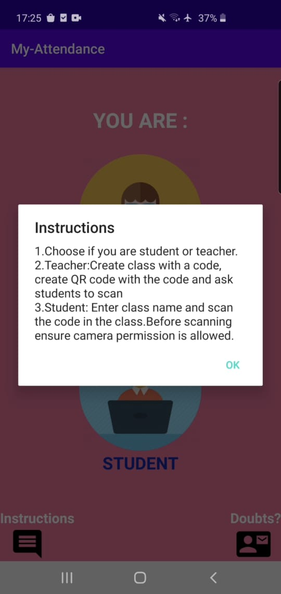
  
  
  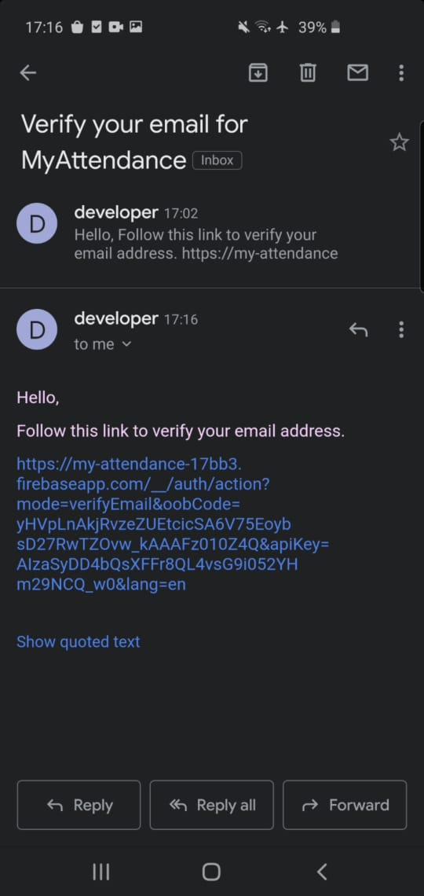
  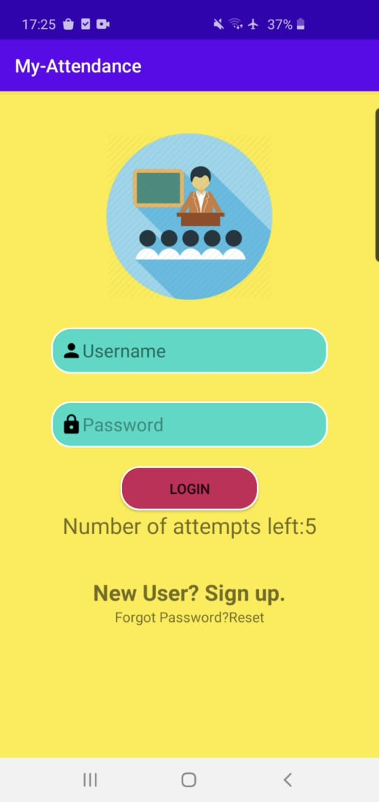

### Create classes for attendance, and a QR code, then scanning of QR from students side

  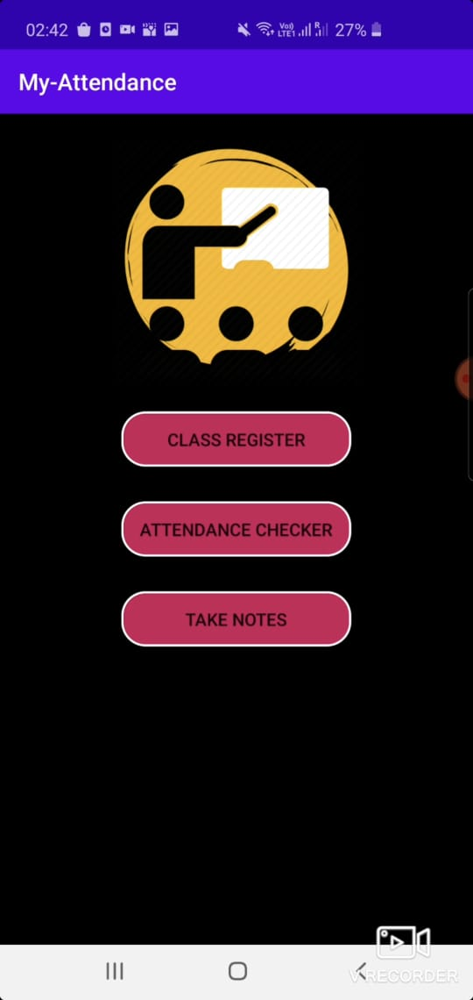
  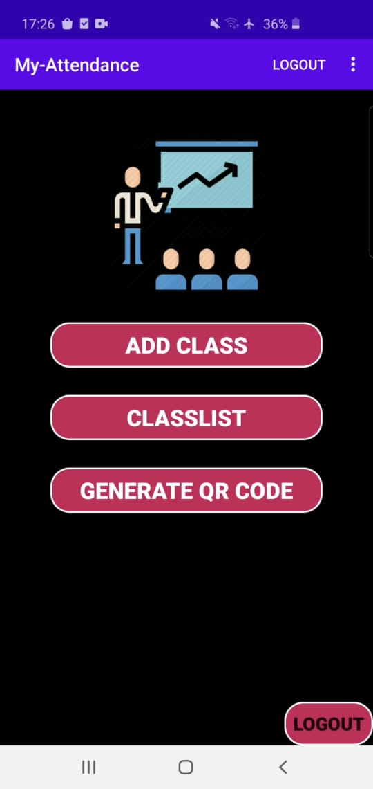

 
  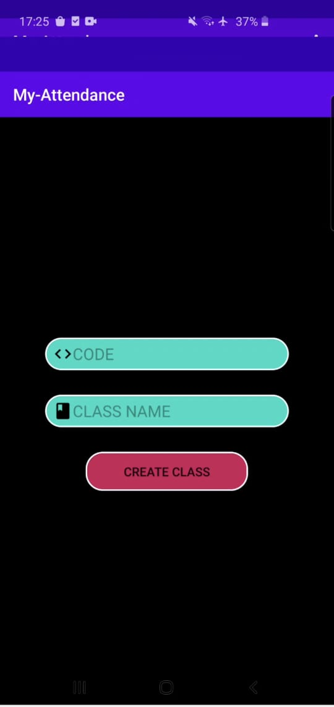
  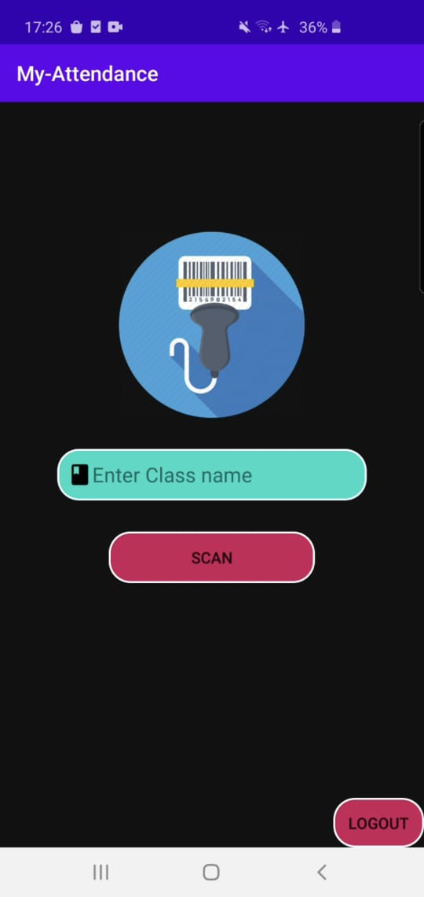
  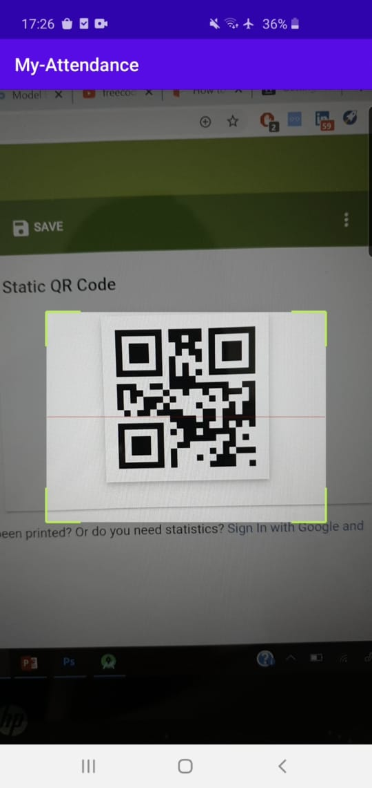
  
  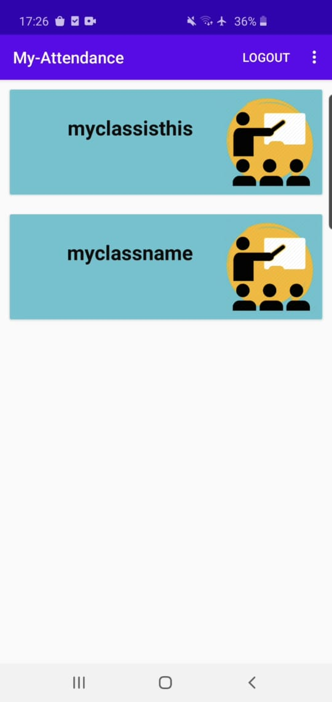

### Additional Features (student side)

  
  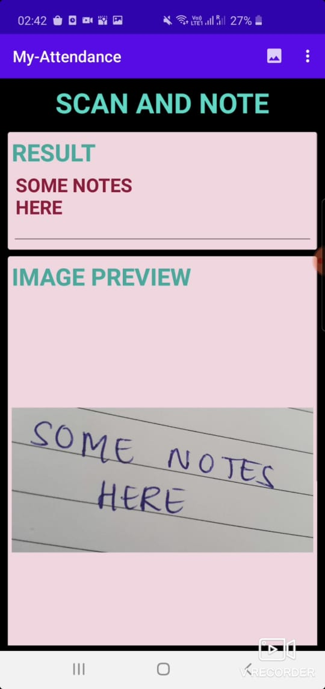
  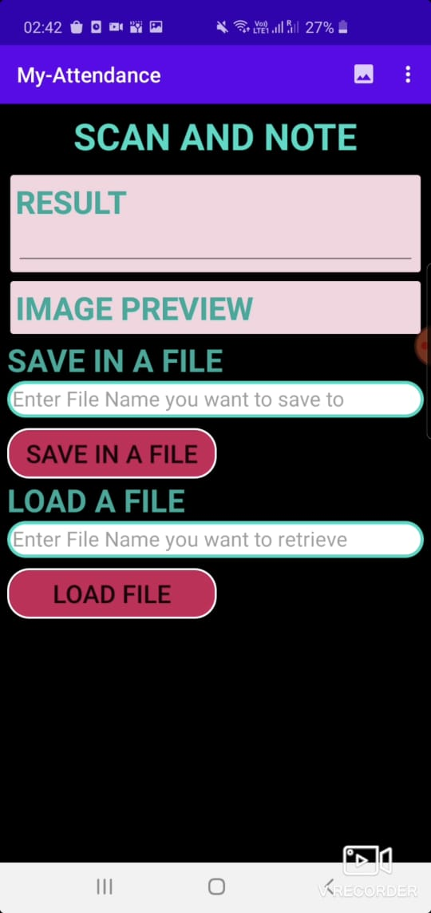

## Database Structure 
- Given below is the basic database structure, having a student side and a teachers side. The classes have another structure outside the member tree. (Not active currently)
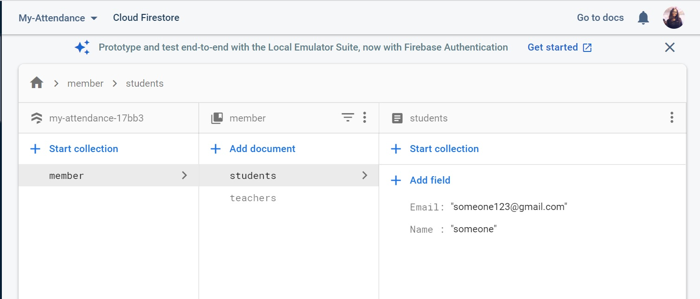

## Setup 
- Clone this repo: git clone (link of this project)
- Open the project in Android Studio and run build
